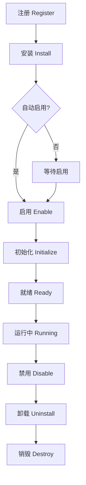

# Daphne Editor Engine - 插件系统文档

## 目录

1. [概述](#概述)
2. [架构设计](#架构设计)
3. [快速开始](#快速开始)
4. [插件开发指南](#插件开发指南)
5. [API 参考](#api-参考)
6. [最佳实践](#最佳实践)
7. [示例插件](#示例插件)
8. [常见问题](#常见问题)

## 概述

Daphne Editor Engine 的插件系统提供了一个强大而灵活的扩展机制，允许开发者轻松地为编辑器添加新功能。

### 主要特性

- **模块化设计**：每个插件都是独立的模块，易于开发和维护
- **生命周期管理**：完整的插件生命周期钩子支持
- **依赖管理**：自动处理插件间的依赖关系
- **热键支持**：内置的快捷键绑定机制
- **事件系统**：强大的事件驱动架构
- **类型安全**：完整的 TypeScript 类型支持

## 架构设计

### 核心组件

```
┌─────────────────────────────────────────────────────────────┐
│                         Engine                              │
│  ┌───────────────────┐  ┌───────────────────┐            │
│  │   PluginManager    │  │     BasePlugin    │            │
│  │                   │  │                   │            │
│  │ - register()      │  │ - initialize()    │            │
│  │ - install()       │  │ - execute()       │            │
│  │ - enable()        │  │ - queryState()    │            │
│  │ - disable()       │  │ - destroy()       │            │
│  └───────────────────┘  └───────────────────┘            │
│           │                       ▲                        │
│           │                       │ extends                │
│           ▼                       │                        │
│  ┌─────────────────────────────────────────┐             │
│  │              Custom Plugins              │             │
│  │  ┌──────────┐ ┌──────────┐ ┌──────────┐│             │
│  │  │   Bold   │ │  Italic  │ │   Link   ││             │
│  │  └──────────┘ └──────────┘ └──────────┘│             │
│  └─────────────────────────────────────────┘             │
└─────────────────────────────────────────────────────────────┘
```

### 插件生命周期



## 快速开始

### 1. 使用内置插件

```typescript
import { Engine, BoldPlugin, ItalicPlugin, LinkPlugin } from '@daphne/engine';

// 创建编辑器实例
const engine = new Engine('#editor', {
  plugins: ['bold', 'italic', 'link']
});

// 注册插件
engine.plugin.register(BoldPlugin);
engine.plugin.register(ItalicPlugin);
engine.plugin.register(LinkPlugin);

// 插件会自动初始化
```

### 2. 创建简单插件

```typescript
import { BasePlugin } from '@daphne/engine';

class HelloPlugin extends BasePlugin {
  static pluginName = 'hello';
  
  static defaultOptions = {
    hotkeys: {
      execute: 'ctrl+h'
    }
  };

  execute() {
    console.log('Hello from plugin!');
  }
}

// 注册并使用
engine.plugin.register(HelloPlugin);
engine.plugin.execute('hello');
```

## 插件开发指南

### 1. 插件结构

每个插件都应该继承自 `BasePlugin` 类：

```typescript
import { BasePlugin, PluginOptions } from '@daphne/engine';

export class MyPlugin extends BasePlugin {
  // 必需：插件名称
  static pluginName = 'my-plugin';
  
  // 可选：默认配置
  static defaultOptions: PluginOptions = {
    version: '1.0.0',
    description: '我的插件',
    author: '作者名',
    dependencies: ['other-plugin'], // 依赖的其他插件
    hotkeys: {
      execute: ['ctrl+m', 'cmd+m']
    },
    config: {
      // 自定义配置
    },
    autoEnable: true,
    priority: 50
  };

  // 必需：执行方法
  execute(...args: any[]): any {
    // 插件主要功能
  }

  // 可选：查询状态
  queryState(): boolean {
    return false;
  }

  // 可选：查询值
  queryValue(): any {
    return null;
  }

  // 可选：初始化
  initialize(): void {
    // 插件初始化逻辑
  }

  // 可选：销毁
  destroy(): void {
    super.destroy(); // 调用父类方法
    // 清理逻辑
  }
}
```

### 2. 生命周期钩子

插件提供了丰富的生命周期钩子：

```typescript
class MyPlugin extends BasePlugin {
  // 插件安装时调用
  async onInstall(engine: Engine): Promise<void> {
    console.log('插件已安装');
  }

  // 插件卸载时调用
  async onUninstall(engine: Engine): Promise<void> {
    console.log('插件已卸载');
  }

  // 插件启用时调用
  async onEnable(engine: Engine): Promise<void> {
    console.log('插件已启用');
  }

  // 插件禁用时调用
  async onDisable(engine: Engine): Promise<void> {
    console.log('插件已禁用');
  }

  // 编辑器就绪时调用
  async onReady(engine: Engine): Promise<void> {
    console.log('编辑器已就绪');
  }

  // 编辑器销毁时调用
  async onDestroy(engine: Engine): Promise<void> {
    console.log('编辑器已销毁');
  }
}
```

### 3. 事件系统

插件可以监听和触发事件：

```typescript
class MyPlugin extends BasePlugin {
  initialize() {
    // 监听编辑器事件
    this.engine.event.on('change', (value) => {
      console.log('内容变化:', value);
    });

    // 监听插件事件
    this.on('custom-event', (data) => {
      console.log('自定义事件:', data);
    });
  }

  execute() {
    // 触发事件
    this.emit('custom-event', { message: 'Hello' });
    
    // 触发编辑器事件
    this.engine.event.trigger('my-plugin:action', { action: 'execute' });
  }
}
```

### 4. 命令注册

插件可以注册多个命令：

```typescript
class MyPlugin extends BasePlugin {
  initialize() {
    // 注册子命令
    this.registerCommand('format', {
      execute: () => {
        console.log('执行格式化');
      },
      queryState: () => false
    });

    this.registerCommand('clear', {
      execute: () => {
        console.log('执行清除');
      }
    });
  }

  execute(command?: string) {
    if (command) {
      const cmd = this.getCommand(command);
      if (cmd?.execute) {
        return cmd.execute();
      }
    }
    // 默认行为
  }
}
```

### 5. 配置管理

插件支持灵活的配置管理：

```typescript
class MyPlugin extends BasePlugin {
  static defaultOptions = {
    config: {
      theme: 'light',
      showTooltip: true,
      maxItems: 10
    }
  };

  initialize() {
    // 获取配置
    const theme = this.getConfig<string>('theme');
    const showTooltip = this.getConfig<boolean>('showTooltip');
    
    // 获取所有配置
    const allConfig = this.getConfig();
    
    // 设置配置
    this.setConfig('theme', 'dark');
  }
}
```

### 6. 工具方法

BasePlugin 提供了许多有用的工具方法：

```typescript
class MyPlugin extends BasePlugin {
  execute() {
    // 获取当前选区
    const range = this.getRange();
    
    // 应用命令（自动处理历史记录）
    this.applyCommand(() => {
      // 执行编辑操作
      // 会自动保存到历史记录
    });
    
    // 触发内容变更
    this.triggerChange();
    
    // 检查功能支持
    if (this.supports('clipboard')) {
      // 使用剪贴板功能
    }
  }
}
```

## API 参考

### PluginManager API

```typescript
interface PluginManagerInterface {
  // 注册插件
  register(pluginClass: PluginConstructor, options?: PluginOptions): void;
  
  // 批量注册
  registerAll(plugins: PluginConstructor[]): void;
  
  // 安装插件
  install(name: string): Promise<void>;
  
  // 卸载插件
  uninstall(name: string): Promise<void>;
  
  // 启用插件
  enable(name: string): Promise<void>;
  
  // 禁用插件
  disable(name: string): Promise<void>;
  
  // 获取插件实例
  get(name: string): Plugin | undefined;
  
  // 获取所有插件
  getAll(): Map<string, PluginMetadata>;
  
  // 检查插件是否存在
  has(name: string): boolean;
  
  // 检查插件是否启用
  isEnabled(name: string): boolean;
  
  // 执行插件命令
  execute(name: string, ...args: any[]): any;
  
  // 查询插件状态
  queryState(name: string): boolean;
  
  // 初始化所有插件
  initializeAll(): Promise<void>;
  
  // 销毁所有插件
  destroyAll(): Promise<void>;
}
```

### Plugin 接口

```typescript
interface Plugin {
  // 核心属性
  name: string;
  options?: PluginOptions;
  
  // 生命周期方法
  onInstall?(engine: Engine): void | Promise<void>;
  onUninstall?(engine: Engine): void | Promise<void>;
  onEnable?(engine: Engine): void | Promise<void>;
  onDisable?(engine: Engine): void | Promise<void>;
  onReady?(engine: Engine): void | Promise<void>;
  onDestroy?(engine: Engine): void | Promise<void>;
  
  // 核心方法
  initialize?(): void;
  execute?(...args: any[]): any;
  queryState?(): boolean;
  queryValue?(): any;
  destroy?(): void;
  
  // 辅助方法
  getEngine?(): Engine;
  getConfig?<T = any>(key?: string): T;
  setConfig?(key: string, value: any): void;
  on?(event: string, callback: EventCallback): void;
  off?(event: string, callback?: EventCallback): void;
  emit?(event: string, ...args: any[]): void;
  isEnabled?(): boolean;
  getHotkeys?(): Record<string, string | string[]>;
  registerCommand?(name: string, command: CommandInterface): void;
  unregisterCommand?(name: string): void;
}
```

### PluginOptions 接口

```typescript
interface PluginOptions {
  version?: string;
  description?: string;
  author?: string;
  dependencies?: string[];
  hotkeys?: Record<string, string | string[]>;
  config?: Record<string, any>;
  autoEnable?: boolean;
  priority?: number; // 数字越大优先级越高
}
```

## 最佳实践

### 1. 插件命名

- 使用小写字母和连字符
- 使用描述性名称
- 避免与核心插件冲突

```typescript
// 好的命名
static pluginName = 'table-editor';
static pluginName = 'emoji-picker';
static pluginName = 'code-highlight';

// 避免的命名
static pluginName = 'plugin1';
static pluginName = 'MyPlugin';
static pluginName = 'p';
```

### 2. 错误处理

始终在插件中进行适当的错误处理：

```typescript
class MyPlugin extends BasePlugin {
  execute() {
    try {
      this.applyCommand(() => {
        // 可能出错的操作
      });
    } catch (error) {
      console.error(`${this.name} plugin error:`, error);
      // 恢复到安全状态
    }
  }
}
```

### 3. 性能优化

- 延迟加载资源
- 使用防抖和节流
- 及时清理事件监听器

```typescript
class MyPlugin extends BasePlugin {
  private debounceTimer?: number;

  initialize() {
    // 使用防抖处理频繁事件
    this.engine.event.on('change', this.debounce(() => {
      this.updateState();
    }, 300));
  }

  private debounce(fn: Function, delay: number) {
    return (...args: any[]) => {
      clearTimeout(this.debounceTimer);
      this.debounceTimer = setTimeout(() => fn(...args), delay);
    };
  }

  destroy() {
    clearTimeout(this.debounceTimer);
    super.destroy();
  }
}
```

### 4. 类型安全

充分利用 TypeScript 的类型系统：

```typescript
interface MyPluginConfig {
  theme: 'light' | 'dark';
  showLineNumbers: boolean;
  tabSize: number;
}

class MyPlugin extends BasePlugin {
  static defaultOptions: PluginOptions = {
    config: {
      theme: 'light',
      showLineNumbers: true,
      tabSize: 4
    } as MyPluginConfig
  };

  getTheme(): 'light' | 'dark' {
    return this.getConfig<MyPluginConfig>().theme;
  }
}
```

## 示例插件

### 1. 格式化插件（Bold）

```typescript
export class BoldPlugin extends BasePlugin {
  static pluginName = 'bold';
  
  static defaultOptions: PluginOptions = {
    hotkeys: {
      execute: ['ctrl+b', 'cmd+b']
    }
  };

  execute() {
    this.applyCommand(() => {
      const range = this.getRange();
      
      if (this.queryState()) {
        this.removeBoldMark();
      } else {
        this.applyBoldMark();
      }
      
      this.triggerChange();
    });
  }

  queryState(): boolean {
    // 检查当前选区是否加粗
    return this.hasMark('strong') || this.hasMark('b');
  }

  private applyBoldMark() {
    // 应用加粗标记
  }

  private removeBoldMark() {
    // 移除加粗标记
  }
}
```

### 2. 元素插件（Link）

```typescript
export class LinkPlugin extends BasePlugin {
  static pluginName = 'link';
  
  static defaultOptions: PluginOptions = {
    hotkeys: {
      execute: ['ctrl+k', 'cmd+k']
    },
    config: {
      allowedProtocols: ['http', 'https', 'mailto'],
      defaultTarget: '_blank'
    }
  };

  execute(options?: { url?: string; text?: string }) {
    if (!options?.url) {
      this.showLinkDialog();
      return;
    }

    this.applyCommand(() => {
      this.insertLink(options);
      this.triggerChange();
    });
  }

  queryState(): boolean {
    return this.getCurrentLink() !== null;
  }

  queryValue() {
    const link = this.getCurrentLink();
    return link ? {
      url: link.href,
      text: link.textContent
    } : null;
  }
}
```

### 3. 工具插件（Word Count）

```typescript
export class WordCountPlugin extends BasePlugin {
  static pluginName = 'word-count';
  
  private countElement?: HTMLElement;

  initialize() {
    this.createCountDisplay();
    
    this.engine.event.on('change', () => {
      this.updateCount();
    });
  }

  execute() {
    const count = this.getWordCount();
    alert(`Word count: ${count}`);
  }

  queryValue() {
    return this.getWordCount();
  }

  private getWordCount(): number {
    const text = this.engine.editArea.text();
    return text.trim().split(/\s+/).filter(word => word.length > 0).length;
  }

  private createCountDisplay() {
    this.countElement = document.createElement('div');
    this.countElement.className = 'word-count';
    this.engine.parentNode.append(this.countElement);
  }

  private updateCount() {
    if (this.countElement) {
      this.countElement.textContent = `Words: ${this.getWordCount()}`;
    }
  }

  destroy() {
    this.countElement?.remove();
    super.destroy();
  }
}
```

## 常见问题

### Q: 如何处理插件间的依赖？

A: 在插件选项中声明依赖：

```typescript
static defaultOptions = {
  dependencies: ['base-plugin', 'another-plugin']
};
```

插件管理器会自动处理依赖关系，确保依赖的插件先被加载。

### Q: 如何在插件间通信？

A: 使用事件系统：

```typescript
// 插件 A 发送事件
this.engine.event.trigger('pluginA:data', { value: 123 });

// 插件 B 监听事件
this.engine.event.on('pluginA:data', (data) => {
  console.log('Received:', data.value);
});
```

### Q: 如何存储插件配置？

A: 使用配置管理方法：

```typescript
// 设置配置
this.setConfig('userPreference', { theme: 'dark' });

// 获取配置
const pref = this.getConfig('userPreference');

// 持久化存储需要结合外部存储方案
localStorage.setItem(`plugin-${this.name}-config`, JSON.stringify(pref));
```

### Q: 如何调试插件？

A: 使用以下技巧：

1. 启用开发模式日志
2. 使用浏览器开发者工具
3. 添加断点和 console.log
4. 使用 try-catch 捕获错误

```typescript
class MyPlugin extends BasePlugin {
  private debug = true;

  execute() {
    if (this.debug) {
      console.log(`[${this.name}] Executing...`);
    }

    try {
      // 插件逻辑
    } catch (error) {
      console.error(`[${this.name}] Error:`, error);
    }
  }
}
```

### Q: 如何测试插件？

A: 创建单元测试：

```typescript
import { Engine } from '@daphne/engine';
import { MyPlugin } from './my-plugin';

describe('MyPlugin', () => {
  let engine: Engine;

  beforeEach(() => {
    engine = new Engine(document.createElement('div'));
    engine.plugin.register(MyPlugin);
  });

  it('should execute correctly', async () => {
    await engine.plugin.enable('my-plugin');
    const result = engine.plugin.execute('my-plugin');
    expect(result).toBeDefined();
  });

  it('should query state correctly', () => {
    const state = engine.plugin.queryState('my-plugin');
    expect(state).toBe(false);
  });
});
```
